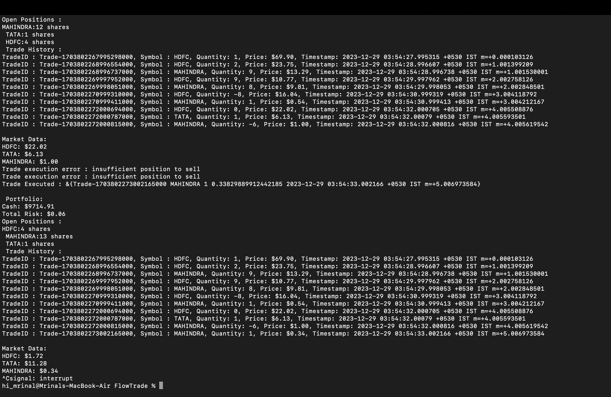

>Test algorithmic trading strategies in a risk-free Golang simulator.

```Note the prices inlist are not the real ones```

TradeFlow is a comprehensive financial simulation project developed in Golang that allows users to model and test algorithmic trading strategies in a controlled environment. The project incorporates various components, including a trading algorithm, portfolio management, market data simulation, and utilities for random data generation.



## Key Features of the algorithm 

1. Trading Algorithm : The simulator includes a robust trading algorithm that executes buy and sell orders based on user-defined parameters. It considers factors such as order size, risk per trade, trailing stop loss, and simple moving average to make informed trading decisions.

2. Portfolio Management : The portfolio management module tracks the user's portfolio, managing cash, open positions, and overall risk exposure. It allows for deposits, withdrawals, and provides a historical record of trades.

3. Market Data Simulation: Simulated market data introduces realistic price fluctuations for various symbols, enabling users to assess the performance of their trading algorithms under diverse market conditions.

4. Utility Functions: The utility package includes essential functions such as generating unique trade IDs, random prices, and other auxiliary operations crucial for the simulation.

## Advantages in the Real World:

- Risk-Free Strategy Testing: Traders and financial analysts can use this simulator to test and refine their algorithmic trading strategies in a risk-free environment before deploying them in live markets. This can potentially save significant financial losses associated with untested strategies.

- Educational Tool: The simulator serves as an educational tool for students, developers, and anyone interested in algorithmic trading. Users can gain hands-on experience in understanding market dynamics, risk management, and the implementation of trading algorithms.

- Portfolio Management Practice: Traders can experiment with different portfolio management strategies, optimize risk exposure, and learn how to balance positions effectively. This practical experience contributes to more informed decision-making in real-world trading scenarios.

## Use Cases:

- Algorithmic Trading Development: Quantitative analysts and algorithmic traders can use the simulator to develop, test, and optimize their trading algorithms before deploying them in live markets.

- Financial Education: Educational institutions and online learning platforms can leverage the simulator to teach students and enthusiasts about algorithmic trading concepts, market dynamics, and risk management.

- Trader Skill Enhancement: Individual traders can use the simulator to enhance their trading skills, experiment with various strategies, and gain confidence in their decision-making abilities without risking real capital.

- Investment Strategy Validation: Institutional investors and hedge funds can use the simulator to validate and fine-tune their investment strategies, ensuring that their algorithms align with their risk tolerance and overall investment objectives.
